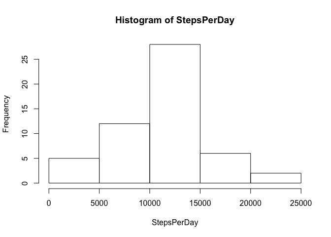
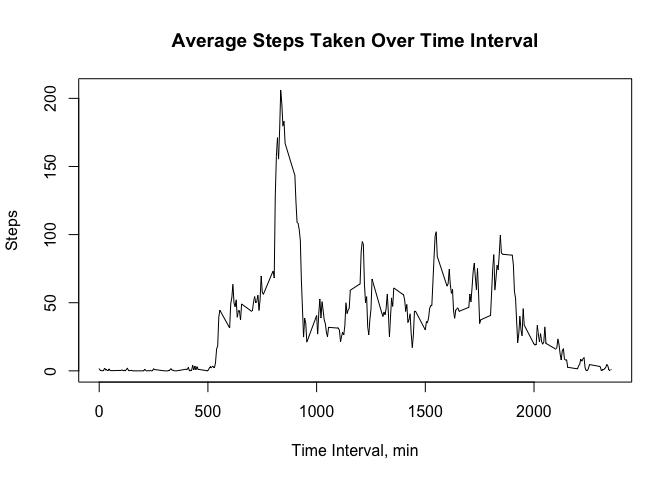
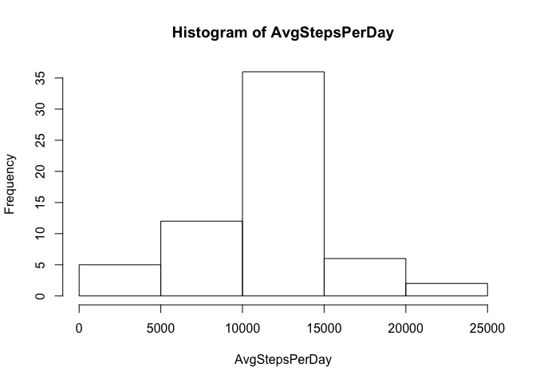
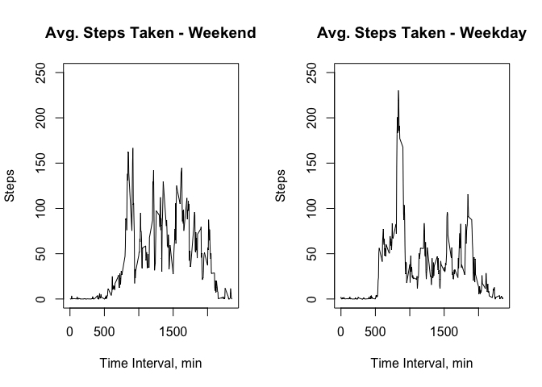

# Reproducible Research: Peer Assessment 1


## Loading and preprocessing the data
The first step will be to take the data and load it into a data frame.


```r
data <- read.csv("activity.csv")
```


## What is mean total number of steps taken per day?

```r
StepsPerDay <- tapply(data$steps, data$date, sum)
hist(StepsPerDay)
```

 

Mean number of steps per day

```r
MeanSteps <- round(mean(StepsPerDay, na.rm=TRUE),1)
print(MeanSteps)
```

```
## [1] 10766.2
```
Median number of steps per day

```r
MedianSteps <- median(StepsPerDay, na.rm=TRUE)
print(MedianSteps)
```

```
## [1] 10765
```

## What is the average daily activity pattern?
The following graph will show the changes in the average number of steps over the course of a specified time interval.

```r
StepsInterval <- round(tapply(data$steps, data$interval, mean, na.rm=TRUE),2)
interval <- data[1:288,3]
joined <- cbind(interval, StepsInterval)
plot(joined, type="l", xlab="Time Interval, min", ylab="Steps")
title(main="Average Steps Taken Over Time Interval")
```

 

The maximum averge number of steps is:

```r
max(joined[,2])
```

```
## [1] 206.17
```
And this takes place over the interval of:

```r
interval[which.max(joined[,2])]
```

```
## [1] 835
```

## Imputing missing values
First, the number of missing values

```r
sum(is.na(data[,1]))
```

```
## [1] 2304
```

Next, a histogram with number of steps per day, using the interval average in place of an NA

```r
data$AvgSteps <- StepsInterval
datawithavgs <- data
size <- dim(datawithavgs)
length <- size[1]
for(i in 1:length){
      truefalse <- is.na(datawithavgs[i,1])
      if(truefalse == TRUE){
             datawithavgs[i,1] = datawithavgs[i,4]     
                   }
}
AvgStepsPerDay <- tapply(datawithavgs$steps, datawithavgs$date, sum)
hist(AvgStepsPerDay)
```

 

Next, mean number of steps per day

```r
AvgMeanSteps <- round(mean(AvgStepsPerDay, na.rm=TRUE),1)
print(AvgMeanSteps)
```

```
## [1] 10766.2
```
Median number of steps per day

```r
AvgMedianSteps <- round(median(AvgStepsPerDay, na.rm=TRUE),0)
print(AvgMedianSteps)
```

```
## [1] 10766
```
Difference in the means, with missing values minus without missing values:

```r
MeanSteps - AvgMeanSteps
```

```
## [1] 0
```
Difference in the medians, with missing values minus without missing values:

```r
MedianSteps - AvgMedianSteps
```

```
## [1] -1
```
## Are there differences in activity patterns between weekdays and weekends?

These two plots will highlight the difference in activity patterns (via the average number of steps taken) between weekdays and weekends.


```r
datawithavgs$day <- weekdays(as.Date(datawithavgs$date))
weekend <- datawithavgs[(datawithavgs$day == "Saturday" | datawithavgs$day == "Sunday"),]
weekday <- datawithavgs[(datawithavgs$day != "Saturday" & datawithavgs$day != "Sunday"),]

par(mfrow = c(1,2))
WkEndStepsInterval <- round(tapply(weekend$steps, weekend$interval, mean),2)
WkEndjoined <- cbind(interval, WkEndStepsInterval)
plot(WkEndjoined, type="l", xlab="Time Interval, min", ylab="Steps",
     ylim=c(0,250))
title(main="Avg. Steps Taken - Weekend")

WkDayStepsInterval <- round(tapply(weekday$steps, weekday$interval, mean),2)
WkDayjoined <- cbind(interval, WkDayStepsInterval)
plot(WkDayjoined, type="l", xlab="Time Interval, min", ylab="Steps", 
     ylim=c(0,250))
title(main="Avg. Steps Taken - Weekday")
```

 
