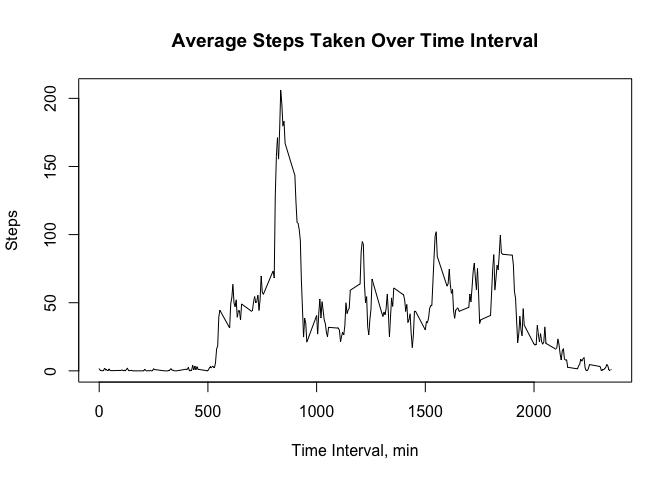
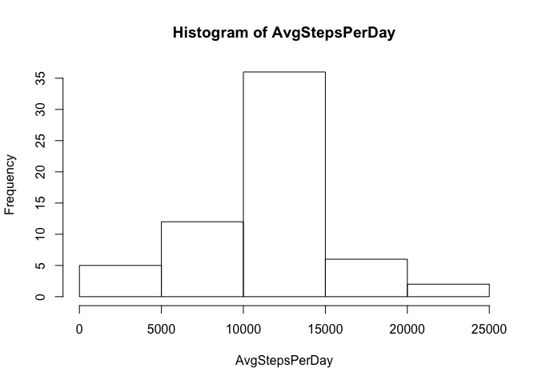

# Reproducible Research: Peer Assessment 1


## Loading and preprocessing the data
The first step will be to take the data and load it into a data frame.


```r
data <- read.csv("activity.csv")
```


## What is mean total number of steps taken per day?

```r
StepsPerDay <- tapply(data$steps, data$date, sum)
hist(StepsPerDay)
```

 


```r
MeanSteps <- round(mean(StepsPerDay, na.rm=TRUE),1)
```
The mean number of steps per day is 1.07662\times 10^{4}.


```r
MedianSteps <- median(StepsPerDay, na.rm=TRUE)
```
The median number of steps per day is 10765.

## What is the average daily activity pattern?
The following graph will show the changes in the average number of steps over the course of a specified time interval.

```r
StepsInterval <- round(tapply(data$steps, data$interval, mean, na.rm=TRUE),2)
interval <- data[1:288,3]
joined <- cbind(interval, StepsInterval)
plot(joined, type="l", xlab="Time Interval, min", ylab="Steps")
title(main="Average Steps Taken Over Time Interval")
```

 


```r
MaxAvg <- max(joined[,2])
```


```r
MaxInterval <- interval[which.max(joined[,2])]
```
The maximum average number of steps is 206.17, and this takes place over the interval starting at 835 minutes.

## Imputing missing values

```r
Missing <- sum(is.na(data[,1]))
```

This data has 2304 values.

Next, a histogram with number of steps per day, using the interval average in place of an NA

```r
data$AvgSteps <- StepsInterval
datawithavgs <- data
size <- dim(datawithavgs)
length <- size[1]
for(i in 1:length){
      truefalse <- is.na(datawithavgs[i,1])
      if(truefalse == TRUE){
             datawithavgs[i,1] = datawithavgs[i,4]     
                   }
}
AvgStepsPerDay <- tapply(datawithavgs$steps, datawithavgs$date, sum)
hist(AvgStepsPerDay)
```

 

Next, mean number of steps per day

```r
AvgMeanSteps <- round(mean(AvgStepsPerDay, na.rm=TRUE),1)
```


```r
AvgMedianSteps <- round(median(AvgStepsPerDay, na.rm=TRUE),0)
```
The mean number of steps per day is 1.07662\times 10^{4} and the median number of steps per day is 1.0766\times 10^{4}.


```r
MeanDiff <- MeanSteps - AvgMeanSteps
```


```r
MedianDiff <- MedianSteps - AvgMedianSteps
```
The difference in means, with the mean (w/ missing values) minus the mean (w/o missing values) is: 0
The difference in medians, with the median (w/ missing values) minus the median (w/o missing values) is: -1

## Are there differences in activity patterns between weekdays and weekends?

These two plots will highlight the difference in activity patterns (via the average number of steps taken) between weekends and weekdays.


```r
datawithavgs$day <- weekdays(as.Date(datawithavgs$date))
weekend <- datawithavgs[(datawithavgs$day == "Saturday" | datawithavgs$day == "Sunday"),]
weekday <- datawithavgs[(datawithavgs$day != "Saturday" & datawithavgs$day != "Sunday"),]

par(mfrow = c(1,2))
WkEndStepsInterval <- round(tapply(weekend$steps, weekend$interval, mean),2)
WkEndjoined <- cbind(interval, WkEndStepsInterval)
plot(WkEndjoined, type="l", xlab="Time Interval, min", ylab="Steps",
     ylim=c(0,250))
title(main="Avg. Steps Taken - Weekend")

WkDayStepsInterval <- round(tapply(weekday$steps, weekday$interval, mean),2)
WkDayjoined <- cbind(interval, WkDayStepsInterval)
plot(WkDayjoined, type="l", xlab="Time Interval, min", ylab="Steps", 
     ylim=c(0,250))
title(main="Avg. Steps Taken - Weekday")
```

 
